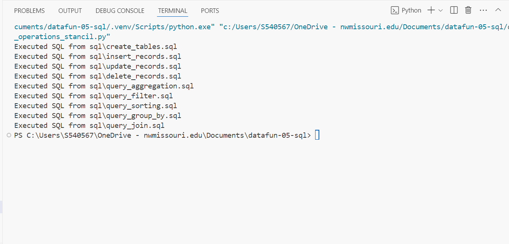
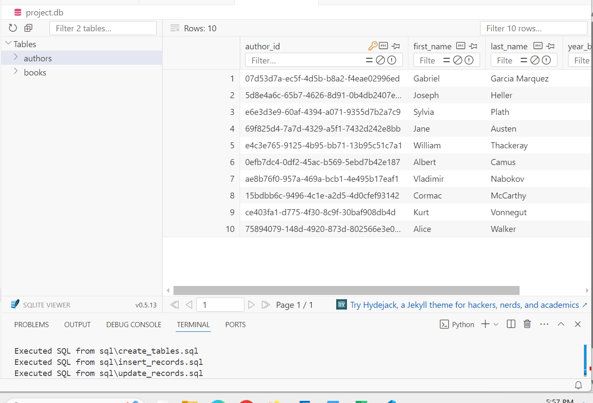

# datafun-05-sql
Module 5 Repository 

This project implements the use of Python and SQL Together

This project uses csv files (authors.csv and books.csv) which are then read in python to create tables within a database 

This project is also logged with the execution of sql queries

This screenshot shows the final output of the executed queries 


This screenshot shows the table after the executed queries 


# Commands used 

```

git add .

git commit -m "Initial Commit"

git push -u origin main

git pull 
```

# Update 

```

git add .

git commit -m "after .venv setup" 

git push -u origin main

```

